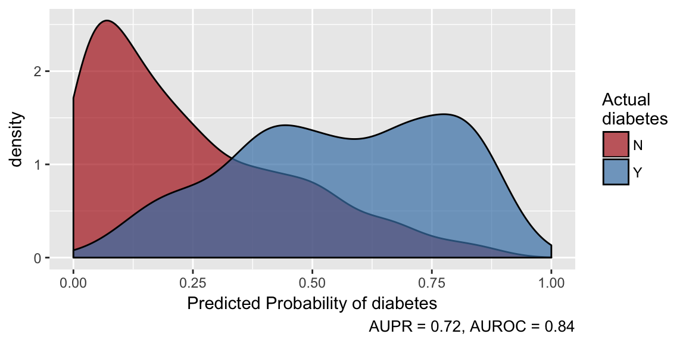

<!-- README.md is generated from README.Rmd. Please edit the .Rmd and knit it to generate the .md. -->

# healthcareai 

[](https://ci.appveyor.com/project/CatalystAdmin/healthcareai-r/)
[](https://travis-ci.org/HealthCatalyst/healthcareai-r)
[](https://codecov.io/gh/HealthCatalyst/healthcareai-r)
[](https://cran.r-project.org/package=healthcareai)
[](https://cranlogs.r-pkg.org/badges/last-week/healthcareai)
[](https://github.com/HealthCatalystSLC/healthcareai-r/blob/master/LICENSE)
[](https://doi.org/10.5281/zenodo.999334)

## Overview

The aim of `healthcareai` is to make machine learning in healthcare as
easy as possible. It does that by providing functions to:

  - Develop customized, reliable, high-performance machine learning
    models with minimal code
  - Easily make and evaluate predictions and push them to a database
  - Understand how a model makes its predictions
  - Make data cleaning, manipulation, imputation, and visualization as
    simple as possible

## Usage

`healthcareai` can take you from messy data to an optimized model in one
line of code:

``` r
models <- machine_learn(pima_diabetes, patient_id, outcome = diabetes)
models
# > Algorithms Trained: Random Forest, eXtreme Gradient Boosting, and glmnet
# > Model Name: diabetes
# > Target: diabetes
# > Class: Classification
# > Performance Metric: AUROC
# > Number of Observations: 768
# > Number of Features: 12
# > Models Trained: 2018-09-01 18:19:44 
# > 
# > Models tuned via 5-fold cross validation over 10 combinations of hyperparameter values.
# > Best model: Random Forest
# > AUPR = 0.71, AUROC = 0.84
# > Optimal hyperparameter values:
# >   mtry = 2
# >   splitrule = extratrees
# >   min.node.size = 12
```

Make predictions and examine predictive performance:

``` r
predictions <- predict(models, outcome_groups = TRUE)
plot(predictions)
```

<!-- -->

## Learn More

For details on what’s happening under the hood and for options to
customize data preparation and model training, see [Getting Started with
healthcareai](https://docs.healthcare.ai/articles/site_only/healthcareai.html)
as well as the helpfiles for individual functions such as
`?machine_learn`, `?predict.model_list`, and `?explore`.

Documentation of all functions as well as vignettes on various uses of
the package are available at the package website:
<https://docs.healthcare.ai/>.

Also, be sure to read our [blog](http://healthcare.ai/blog/) and watch
our
[broadcasts](https://www.youtube.com/channel/UCGZUobs_x712KbcL6RSzfnQ)
to learn more about what’s new in healthcare machine learning and how we
are using this toolkit to put machine learning to work in real
healthcare systems.

## Get Involved

We have a [Slack community](https://healthcare-ai.slack.com/) that is a
great place to introduce yourself, share what you’re doing with the
package, ask questions, and troubleshoot your code.

### Contributing

If you are interested in contributing the package (great\!), please read
the
[contributing](https://github.com/HealthCatalyst/healthcareai-r/blob/master/CONTRIBUTING.md)
guide, and look for [issues with the “help wanted”
tag](https://github.com/HealthCatalyst/healthcareai-r/labels/help%20wanted).
Feel free to tackle any issue that interests you; those are a few issues
that we feel would make a good place to start.

### Feedback

Your feedback is hugely appreciated. It is makes the package work well
and helps us make it more useful to the community. Both feature requests
and bug reports should be submitted as [Github
issues](https://github.com/HealthCatalyst/healthcareai-r/issues/new).

**Bug reports** should be filed with a [minimal reproducable
example](https://gist.github.com/hadley/270442). The [reprex
package](https://github.com/tidyverse/reprex) is extraordinarily helpful
for this. Please also include the output of `sessionInfo()` or better
yet, `devtools::session_info()`.

## Legacy

Version 1 of `healthcareai` has been retired. You can continue to use
it, but its compatibility with changes in the R ecosystem are not
guaranteed. You should always be able to install it from github with:
`install.packages("remotes");
remotes::install_github("HealthCatalyst/healthcareai-r@v1.2.4")`.

For an example of how to adapt v1 models to the v2 API, check out the
[Transitioning
vignettes](https://docs.healthcare.ai/articles/site_only/transitioning.html).
