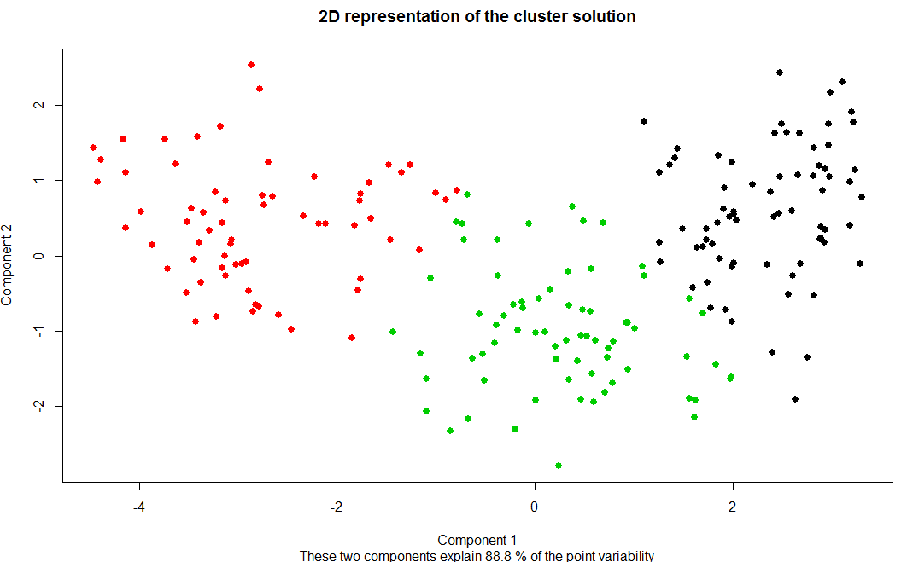
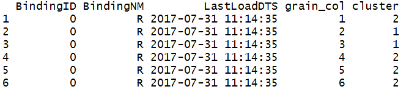
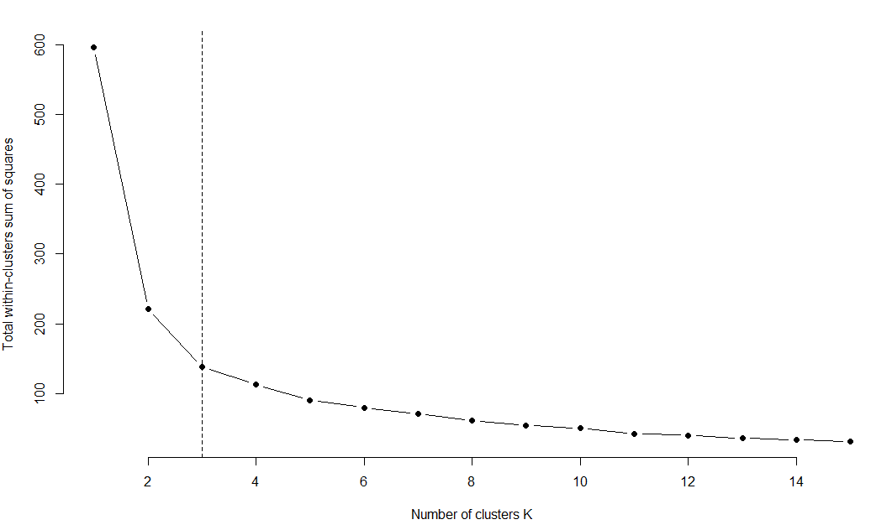
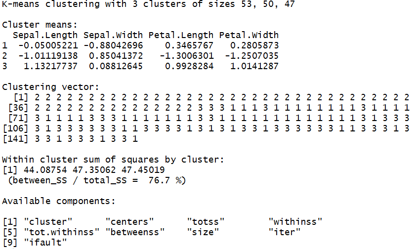
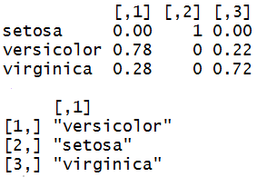
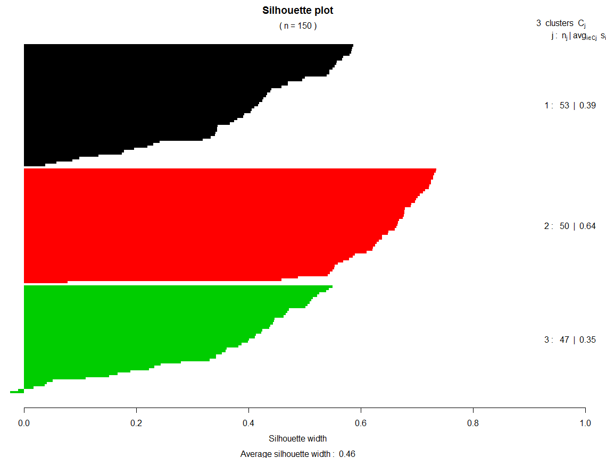
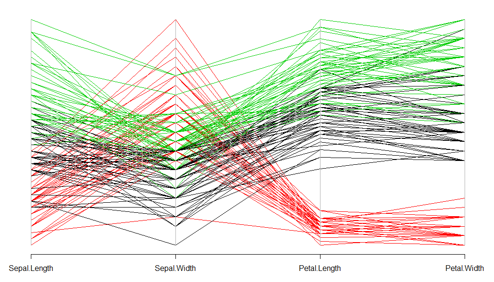
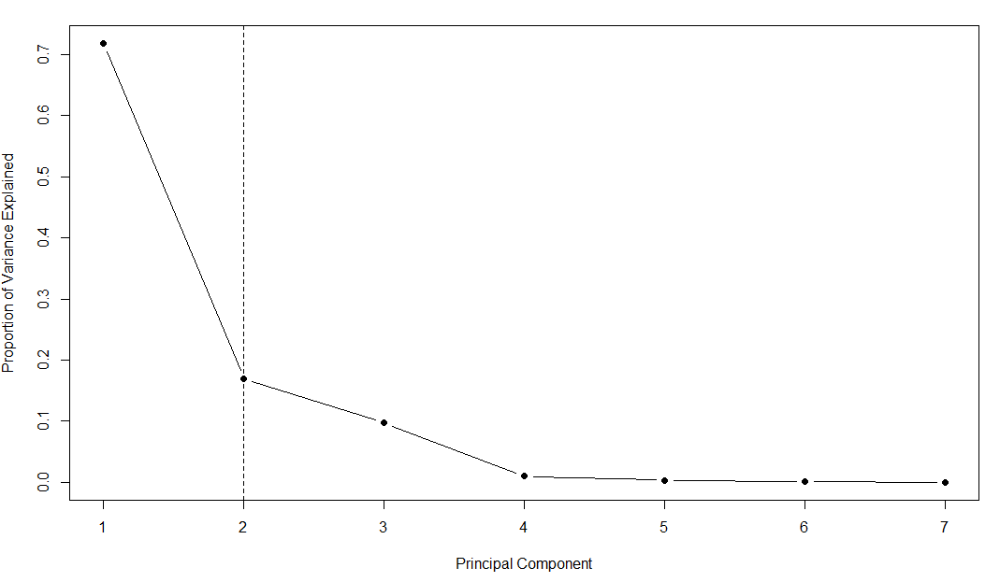

# Cluster analysis via `KmeansClustering`

# What is this?

This class let one perform kmeans clustering on numeric datasets.

## Is any dataset ready for model creation?
Nope. This method only works for numerical dataset. So it'll help if you can 
remove the non-numeric columns from the dataset beforehand, and set the grain col and label col if there is any.

## Step 1: Load data and packages 

```r
ptm <- proc.time()
library(healthcareai)

# This example uses csv data
# setwd('C:/Yourscriptlocation/Useforwardslashes') # Uncomment if using csv

# Can delete this line in your work
csvfile <- system.file("extdata", 
                       "seeds_dataset.csv", 
                       package = "healthcareai")

# Replace csvfile with 'path/file'
df <- read.csv(file = csvfile, 
               header = TRUE, 
               na.strings = c("NULL", "NA", ""))
              
str(df)
head(df)

```

## Step 2: Set your parameters via ``UnsupervisedModelParams``

- __Return__: an object representing your specific configuration.
- __Arguments__:
    - __df__: a data frame. The data your model is based on.
    - __impute__: a boolean, defaults to FALSE. Whether to impute by replacing NULLs with column mean (for numeric columns) or column mode (for categorical columns).
    - __grainCol__: a string, defaults to None. Name of possible GrainID column in your dataset. If specified, this column will be removed, as it won't help the algorithm.
    - __debug__: a boolean, defaults to FALSE. If TRUE, console output when comparing models is verbose for easier debugging.
    - __cores__: an int, defaults to 4. Number of cores on machine to use for model training.

```r
p <- UnsupervisedModelParams$new()
p$df <- df
p$grainCol <- "grain_col"
p$impute <- TRUE
p$debug <- FALSE
p$cores <- 1
```

## Step 3: Create the clustering via the `KmeansClustering` algorithms.

```r
# Run kmeans 
cl1 <- KmeansClustering$new(p)
cl1$run()
```

## Step 4: 2D visualization of the clusters
```r
cl1$get2DClustersPlot()
```


If you want to label each point with its grain ID, just call
```r
cl1$get2DClustersPlot(TRUE)
```

## Step 5: Get the output data frame
```r
outDf_seed <- cl1$getOutDf()
head(outDf_seed)

# Write to CSV (or JSON, MySQL, etc) using plain R syntax
write.csv(outDf_seed,'path/clusteringresult.csv')
```


## Full example code

```r
ptm <- proc.time()
library(healthcareai)
# This example uses csv data
# setwd('C:/Yourscriptlocation/Useforwardslashes') # Uncomment if using csv

# Can delete this line in your work
csvfile <- system.file("extdata", 
                       "seeds_dataset.csv", 
                       package = "healthcareai")

# Replace csvfile with 'path/file'
df <- read.csv(file = csvfile, 
               header = TRUE, 
               na.strings = c("NULL", "NA", ""))
              
str(df)
head(df)

p <- UnsupervisedModelParams$new()
p$df <- df
p$grainCol <- "grain_col"
p$impute <- TRUE
p$debug <- FALSE
p$cores <- 1

# Run kmeans 
cl1 <- KmeansClustering$new(p)
cl1$run()

cl1$get2DClustersPlot()

outDf_seed <- cl1$getOutDf()
head(outDf_seed)

# Write to CSV (or JSON, MySQL, etc) using plain R syntax
write.csv(outDf_seed,'path/clusteringresult.csv')

cat(proc.time() - ptm,"\n")
```
## Note: how to choose the optimal number of clusters?
You can set the number of clusters by yourself when setting the parameters in step 2.

```r
p <- UnsupervisedModelParams$new()
p$df <- df
p$grainCol <- "grain_col"
p$numOfClusters <- 3
p$impute <- TRUE
p$debug <- FALSE
p$cores <- 1
```

Otherwise `KmeanClustering` will choose the number of clusters for you using the [elbow plot](https://bl.ocks.org/rpgove/0060ff3b656618e9136b) built in the method. In this example, we will build three clusters according to the elbow plot.

```r
cl1$getElbowPlot()
```



## A more detailed example with dataset that has a label col
It is possible that the dataset already has a label column that assigns each row 
to a group. In this case, if your goal is to do classification, there are supervised models like `RandonForesrDevelopment', 'XGBoostDevelopment` available in `healthcareai` package. In the unsupervised models like clustering, label column can only be used for validatoin. We compare the clustering result achieved by `KmeansClustering` with the original labels to evaluate the accuracy of the clustering method. And only when `labelCol` is provided, functions getClusterLabels and getConfusionMatrix are available.

### Step 1: Load data and packages, set parameters and create clusterings
```r
# Let's use the famous build-in data set iris as an example
ptm <- proc.time()
library(healthcareai)

data(iris)
head(iris)

# Set params
p <- UnsupervisedModelParams$new()
p$df <- iris
p$labelCol <- "Species"
p$impute <- TRUE
p$debug <- FALSE
p$cores <- 1

# Run kmeans 
cl2 <- KmeansClustering$new(p)
cl2$run()
```
### Step 2: View the clustering result
```r
cl2$getKmeansfit()
```


### Step 3: Compare the clustering result with the original labels

The confusion matrix showes that all iris setosa are assigned to cluster 2. 
78% of iris versicolor and 28% of iris virginica are assigned to cluster 1. 22% of iris versicolor and 72% of iris virginica are assigned to cluster 3. Hence the best way to label the clusters is to label cluster 1 with versicolor, cluster 2 with setosa and cluster 3 with virginica. 

```r
cl2$getConfusionMatrix()
cl2$getClusterLabels()
```


### Step 4: Visualization of the clustering 
Besides the 2D visualization plot, `KmeansClustering` also contains [silhouette plot](https://en.wikipedia.org/wiki/Silhouette_(clustering)) and [parallel coordinates plot](https://en.wikipedia.org/wiki/Parallel_coordinates). 
 
```r
cl2$getSilhouettePlot()
```


```r
cl2$getParallelCoordinatePlot()
```


### Step 5: Get the output data frame
```r
outDf_iris <- cl2$getOutDf()
head(outDf_iris)

# Write to CSV (or JSON, MySQL, etc) using plain R syntax
write.csv(outDf_iris,'path/clusteringresult.csv')
```

### Full example code for the detailed example

```r
ptm <- proc.time()
library(healthcareai)
ptm <- proc.time()
library(healthcareai)

data(iris)
head(iris)

# Set params
p <- UnsupervisedModelParams$new()
p$df <- iris
p$labelCol <- "Species"
p$impute <- TRUE
p$debug <- FALSE
p$cores <- 1

# Run kmeans 
cl2 <- KmeansClustering$new(p)
cl2$run()

cl2$getKmeansfit()

cl2$getConfusionMatrix()
cl2$getClusterLabels()

cl2$getSilhouettePlot()
cl2$getParallelCoordinatePlot()

outDf_iris <- cl2$getOutDf()
head(outDf_iris)

# Write to CSV (or JSON, MySQL, etc) using plain R syntax
write.csv(outDf_iris,'path/clusteringresult.csv')

cat(proc.time() - ptm,"\n")
```

## PCA is built in `KmeansClustering`

In case that we may have data sets with a large number of features, PCA is built in `KmeansClustering` to reduce the features to use when building clusters. Let's use the csv file of  seeds_dataset again as an example. 

```r
ptm <- proc.time()
library(healthcareai)
# This example uses csv data
# setwd('C:/Yourscriptlocation/Useforwardslashes') # Uncomment if using csv

# Can delete this line in your work
csvfile <- system.file("extdata", 
                       "seeds_dataset.csv", 
                       package = "healthcareai")

# Replace csvfile with 'path/file'
df <- read.csv(file = csvfile, 
               header = TRUE, 
               na.strings = c("NULL", "NA", ""))
              
str(df)
head(df)

p <- UnsupervisedModelParams$new()
p$df <- df
p$grainCol <- "grain_col"
p$impute <- TRUE
p$debug <- FALSE
p$cores <- 1

# Run kmeans 
cl3 <- KmeansClustering$new(p)
cl3$run()
```

After loading the data, setting the params and running Kmeans, we can have a look of the [scree plot](http://support.minitab.com/en-us/minitab/17/topic-library/modeling-statistics/multivariate/principal-components-and-factor-analysis/what-is-a-scree-plot/)

```r
cl3$getScreePlot()
```


Then you can choose whether you want to use the PCs to do Kmeans clustering by setting the parameter `usePrinComp` to `TRUE` or `FALSE`. And you can decide how many PCs you want to use in clustering based on the scree plot. Or `KmeansClustering` will determine for you just by using the elbow point in the scree plot.

### Full example code for PCA
```r
ptm <- proc.time()
library(healthcareai)
# This example uses csv data
# setwd('C:/Yourscriptlocation/Useforwardslashes') # Uncomment if using csv

# Can delete this line in your work
csvfile <- system.file("extdata", 
                       "seeds_dataset.csv", 
                       package = "healthcareai")

# Replace csvfile with 'path/file'
df <- read.csv(file = csvfile, 
               header = TRUE, 
               na.strings = c("NULL", "NA", ""))
              
str(df)
head(df)

p <- UnsupervisedModelParams$new()
p$df <- df
p$grainCol <- "grain_col"
p$usePrinComp <- TRUE
# p$numOfPrinComp <- 2 ## Optional
p$impute <- TRUE
p$debug <- FALSE
p$cores <- 1

# Run kmeans 
cl3 <- KmeansClustering$new(p)
cl3$run()

# 2D visualization plot
cl3$get2DClustersPlot()

# Output data
outDf_seed_pca <- cl3$getOutDf()
head(outDf_seed_pca)

# Write to CSV (or JSON, MySQL, etc) using plain R syntax
write.csv(outDf_seed_pca,'path/clusteringresult.csv')

cat(proc.time() - ptm,"\n")
```


