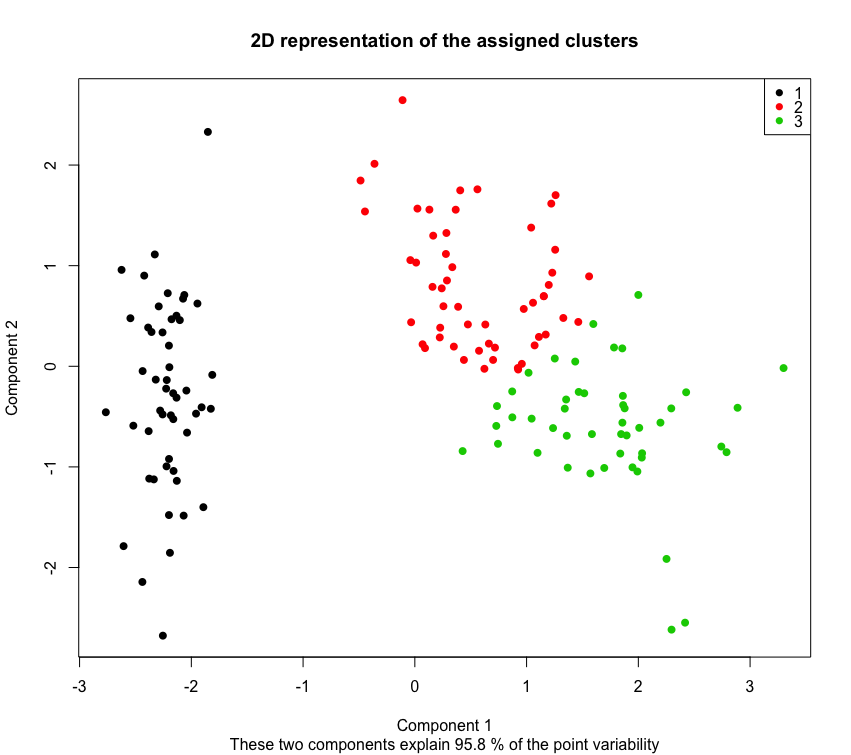
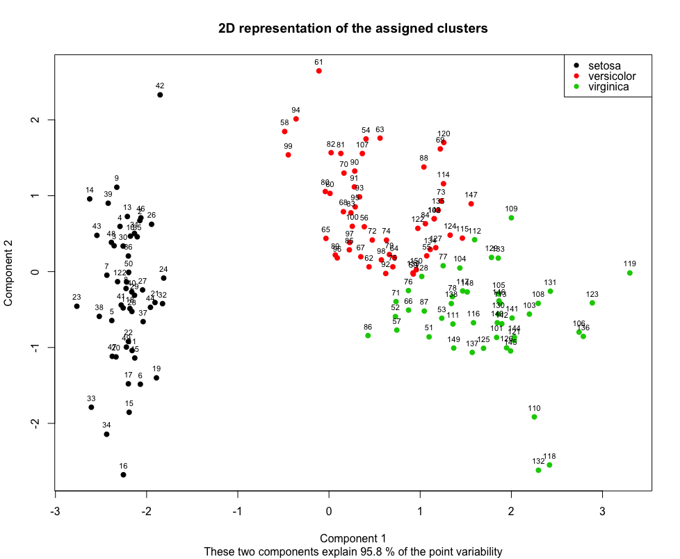

# Cluster Analysis Using`KmeansClustering`

This functionality allows exploration of data using Kmeans clustering.

##### What are the data type requirements?
This method only works for datasets with numeric and binary columns. You must remove categorical columns. The grain column and label columns are optional.

## Example 1: Data Exploration

__Step 1:__ Load data and packages
```r
library(healthcareai)

# This example uses the iris dataset without labels
data(iris)
df <- iris
df$Species <- NULL
              
str(df)
head(df)
```

__Step 2:__ Set your parameters via `UnsupervisedModelParams`
- __Arguments__:
    - __df__: Dataframe whose columns are used for calc.
    - __grainCol__: Optional. The dataframe's column that has IDs pertaining to 
       the grain. No ID columns are truly needed for this step. If left blank, row
       numbers are used for identification.
    - __labelCol__: Optional. Labels will not be used for clustering. Labels can
      be can be used for validation. The number of clusters should be the same as
      the number of labels. Functions getClusterLabels() and getConfusionMatrix()
      are only available if labelCol is provided. Generally, supervised models
      are a better choice if your goal is classification.
    - __numOfClusters__ Optional. Number of clusters you want to build. If left blank,
      will be determined automatically from the elbow plot.
    - __usePCA__ Optional. TRUE or FALSE. Default is FALSE. If TRUE, the
      method will use principle components as the new features to perform K-means
      clustering. This may accelerate convergence on high-dimension datasets.
    - __numOfPCA__ Optional. If using principle components, you may specify
      the number to use to perform K-means clustering. If left blank, it will be
      determined automatically from the scree (elbow) plot.
    - __impute__: a boolean, defaults to FALSE. Whether to impute by replacing NULLs with column mean (for numeric columns) or column mode (for categorical columns).
    - __debug__: a boolean, defaults to FALSE. If TRUE, console output when comparing models is verbose for easier debugging.
- __Return__: a configuration object

```r
p <- UnsupervisedModelParams$new()
p$df <- df
p$impute <- TRUE
p$debug <- FALSE
p$cores <- 2
# p$numOfClusters <- 3 # Optional parameter
```
Note: The `numOfClusters` parameter will select the number of clusters to use. If left
blank, Kmeans will use PCA to automatically find the optimal number of clusters. You
can visualize this search using `getElbowPlot()`.

__Step 3:__ Create the clusters via the `KmeansClustering` algorithm.

```r
# Run kmeans 
cl <- KmeansClustering$new(p)
cl$run()
```

__Step 4:__ Visualize the clusters in 2 dimensions
```r
cl$get2DClustersPlot()
```


__Step 5:__ Save the output to a .csv
```r
dfOut <- cl$getOutDf()
head(dfOut)

# Write to CSV (or JSON, MySQL, etc) using plain R syntax
write.csv(dfOut, 'cluster_result.csv')
```

#### Full example code
```r
ptm <- proc.time()
library(healthcareai)

# This example uses the iris dataset
data(iris)
df <- iris
df$Species <- NULL
              
str(df)
head(df)

p <- UnsupervisedModelParams$new()
p$df <- df
p$impute <- TRUE
p$debug <- FALSE
p$cores <- 2
# p$numOfClusters <- 3 # Optional parameter

cl <- KmeansClustering$new(p)
cl$run()

cl$get2DClustersPlot()

dfOut <- cl$getOutDf()
head(dfOut)

# Write to CSV (or JSON, MySQL, etc) using plain R syntax
write.csv(dfOut, 'cluster_result.csv')

print(proc.time() - ptm,"\n")
```

## Example 2: Clustering a Labeled Dataset for Classification Validation

You may have a dataset with categorical groups. If your goal is to do classification, there are supervised models like `RandonForestDevelopment` and `XGBoostDevelopment` available in the `healthcareai` package that are more suitable.

You can use KMeansClustering to compare the existing label column to clustering's pattern recognition. (As opposed to assuming the known label is truth.) If the `labelCol` is provided, methods `getClusterLabels` and `getConfusionMatrix` are available.

__Step 1:__ Load data and packages 
```r
library(healthcareai)

# This example uses the iris dataset without labels
data(iris)
df <- iris
              
str(df)
head(df)
```

__Step 2:__ Set your parameters via `UnsupervisedModelParams`
```r
p <- UnsupervisedModelParams$new()
p$df <- df
p$labelCol <- 'Species'
p$impute <- TRUE
p$debug <- FALSE
p$cores <- 2
```

__Step 3:__ Create the clusters via the `KmeansClustering` algorithms.
```r
# Run kmeans 
cl <- KmeansClustering$new(p)
cl$run()
```

__Step 4:__ Visualize the clusters in 2 dimensions
```r
cl$get2DClustersPlot(TRUE) # Prints labels
```


__Step 5:__ Save the output to a .csv
```r
dfOut <- cl$getOutDf()
head(dfOut)

# Write to CSV (or JSON, MySQL, etc) using plain R syntax
write.csv(outDf_seed,'path/clusteringresult.csv')
```

#### Full example code
```r
ptm <- proc.time()
library(healthcareai)

# This example uses the iris dataset
data(iris)
df <- iris
              
str(df)
head(df)

p <- UnsupervisedModelParams$new()
p$df <- df
p$labelCol <- 'Species'
p$impute <- TRUE
p$debug <- FALSE
p$cores <- 2

cl <- KmeansClustering$new(p)
cl$run()

cl$get2DClustersPlot(TRUE)

dfOut <- cl$getOutDf()
head(dfOut)

# Write to CSV (or JSON, MySQL, etc) using plain R syntax
write.csv(outDf_seed,'path/clusteringresult.csv')

print(proc.time() - ptm,"\n")
```

## Built-in Principle Component Analysis

If your dataset has a large number of features, `KmeansClustering` may be very slow. You can reduce the dimensionality and speed up clustering using PCA.
```r
# While setting params
p$usePCA <- TRUE
# p$numOfPCA <- 3 # Optional
```
Note: The `numOfPCA` parameter will select the number of PCs to use. If left blank, Kmeans will automatically find the optimal number of PCs to use. You can visualize this search using `getScreePlot()`.
