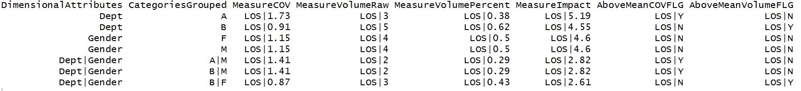

# Search across subgroups and find high variation via `findVariation`

## What is this?
In healthcare, outcomes improvement often comes from reducing variation. First, however,
one must find the group that has 
  
  1. Oddly high variation (within some measure).
  2. A large number of folks in the cohort, such that an improvement effort is worthwhile. 
  
This tool solves that problem.

## Why is it helpful?

One can now quickly search across hundreds of subgroups and various 
measures (like length of stay, readmissions, missed-payment, etc.) to find
groups that need improvement. With most healthcare datasets of <100k rows, 
this search only takes a few seconds.

## So, how do we do it?

We use [coefficient of variation, or COV](https://en.wikipedia.org/wiki/Coefficient_of_variation) to compare variation between groups.

Let's get started in RStudio!

* First, we'll load healthcareai, create a fake dataset on which to work, 
and look at it:

```r
library(healthcareai)

df <- data.frame(Dept = c('A','A','A','B','B','B','B','B'),
                 Gender = c('F','M','M','M','M','F','F','F'),
                 LOS = c(3.2,NA,5,1.3,2.4,4,9,10))

head(df)
```

* Next, we'll search for the subgroups that have both high variation and a lot 
of folks. Note that we define our subgroups by `Dept` and `Gender` and are using
length of stay (`LOS`) as our measure of interest.

```r
categoricalCols <- c("Dept","Gender")

dfRes <- findVariation(df = df, 
                       categoricalCols = categoricalCols,
                       measureColumn = "LOS")

dfRes
```

## Function specs for ``findVariation``

- __Return__: a data frame eight columns wide, with info on variation and volume. 
Rows are ranked by insight (which is COV * number of rows in that subgroup).
- __Arguments__:
    - __df__: a data frame that has both a measure and a categorical column.
    - __categoricalCols__: Vector of strings representing categorical column(s)
    - __measureColumn__: Vector of strings representing measure column(s)
    - __dateCol__: Optional. A date(time) column to group by (done by month).
    - __threshold__: A scalar number, representing the minimum impact values 
    that are returned

## Full example code

```r
library(healthcareai)
df <- data.frame(Dept = c('A','A','A','B','B','B','B','B'),
                 Gender = c('F','M','M','M','M','F','F','F'),
                 LOS = c(3.2,NA,5,1.3,2.4,4,9,10))

categoricalCols <- c("Dept","Gender")

dfRes <- findVariation(df = df, 
                       categoricalCols = categoricalCols,
                       measureColumn = "LOS")

dfRes
```

## Function output



Output notes!

* The `MeasureVolumeRaw` column is simply a count of how many rows were in that
particular subgroup. 

* The `MeasureImpact` column is simply `MeasureCOV` * `MeasureVolumeRaw`

* The rows returned are ordered using
    1. Depth (i.e., number of columns listed in `DimensionalAttributes`)
    2. First column name listed in `DimensionalAttributes`
    3. `MeasureImpact`. Highest within that subgroup is listed first.

As always, you can see the built-in docs via
```r
library(healthcareai)
?findVariation
```
