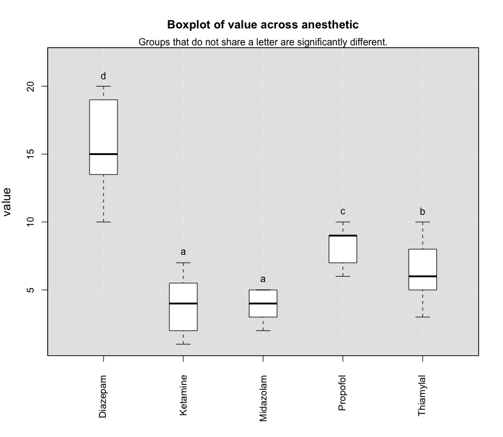
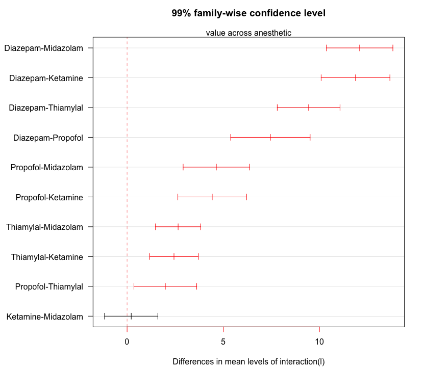

# Visualize variation across subgroups via `variationAcrossGroups`

## Why is it helpful?
In healthcareai, we have the function `findVariation` that will search across 
all combinations of groups and various measures to find high variation, and 
return a data frame with information on variation and potential impact. 
`variationAcrossGroups` compares variations across all combinations
of groups by presenting a visualization. A boxplot shows size and distribution of 
each group, and a letter above the box indicates if 
there is a significant difference in the group means.

This function can help answer questions like, "Which physicians order high-cost tests frequently with respect to their peers?" 


### Example

First, we'll load healthcareai and build a test dataset with two columns:
blood test result (value) and an anesthetic treatment (anesthetic). There are five anesthetics in the dataset: Midazolam, Propofol, Ketamine, Thiamylal, and Diazepam.

```r
library(healthcareai)

set.seed(35)
df1 <- data.frame(
  anesthetic = c(rep("Midazolam", 50), rep("Propofol", 20), rep("Ketamine", 40), 
                 rep("Thiamylal", 80),  rep("Diazepam", 20)),
  value = c(sample(2:5, 50, replace = TRUE), sample(6:10, 20, replace = TRUE), 
            sample(1:7, 40, replace = TRUE), sample(3:10, 80, replace = TRUE), 
            sample(10:20, 20, replace = TRUE)))                      
head(df1)
```

Define the categorical column, `anesthetic`, as a subgroup. We will assess their effect on the blood test stored in the `value` column using `variationAcrossGroups`.

```r
variationAcrossGroups(df = df1, 
                      categoricalCols = "anesthetic", 
                      measureColumn = "value", 
                      sigLevel = .01)
```
If you have other categorical columns, it will show all combinations of groups. If you'd like to group by temporal variables, it's possible to separate dates by day, week, year, etc.

### Interpreting the output



The boxplot tells us that Diazepam, Propofol, and Thiamylal all have 
significantly different mean values from all other groups, including each other
(p <= 0.01). Midazolam and Ketamine do not have significantly different mean 
values because they share the label "a", but they are significantly different 
from all the other treatments.



This plot present the results
of the Tukey's Honest Significant Differences test. It compares all possible
pairs of groups and adjusts p-values for multiple comparisons. Red lines
indicate a significant difference between the two groups at the chosen 
significance level (0.05 by default). Groups are ordered by p-values. The
group with the greater mean value is always listed first.


### Function params for ``variationAcrossGroups``
- __Arguments__:
    - __df__: A data frame containing group and measure columns.
    - __categoricalCols__: Character. Vector containing the name(s) of column(s) to group by.
    - __measureColumn__: Character. The name of the numeric variable of interest.
    - __plotGroupDifferences__: Optional. Logical. Plot results of Tukey's HSD test: mean differences between groups and confidence intervals for each pairwise group comparison? Default is FALSE.
    - __returnGroupStats__: Optional. Logical. In addition to the model summary table, return summary statistics for each group? Default is FALSE.
    - __dateCol__: Optional. A date(time) column to group by (done by month).
    - __levelOfDateGroup__: Optional. Character. Level at which to group dateCol. One of "yearly", "quarterly", "monthly" (default), or "weekly".
    - __sigLevel__: Optional. Numeric value between zero and one giving the alpha value for Tukey HSD test, i.e. the p-value threshold for significance.
    