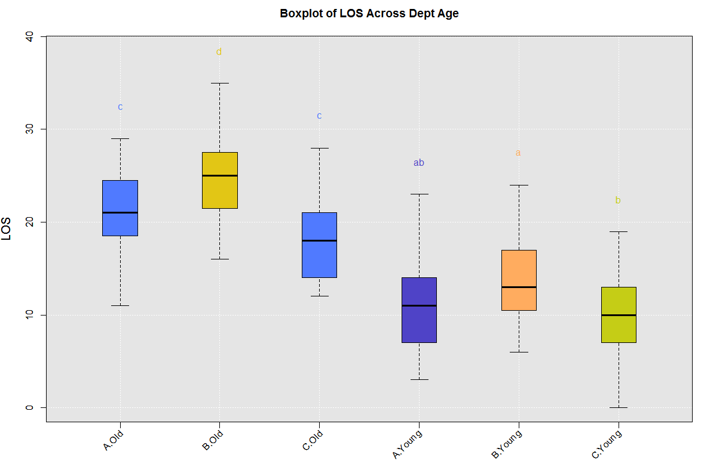
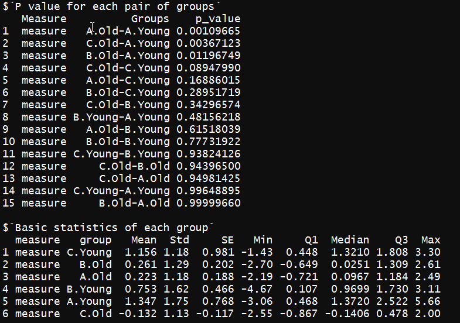

# Plot boxplot across subgroups via `variationAcrossGroups`

## Why is it helpful?
In healthcareai, we have the function `findVariation` that will search across 
all combinations of groups and various measures to find high variation, and 
return a data frame with information on variation and volumn. 
`variationAcrossGroups`, furthermore, compares variations across all combinations
of groups by presenting a boxplot, with a letter above the box, indicating if 
there is a significant difference in the means of the combinations of groups. 
For example, of all the patients (Female and Male, Old and Young), which group
(among Female/Old, Female/Young, Male/Old and Male/Young) has the longest length of stay?


## How to use the function.

Let's get started in RStudio!

* First, we'll load healthcareai, create a fake dataset on which to work, 
and look at it:

```r
library(healthcareai)

set.seed(2017)
n = 200
df <- data.frame(Dept = sample(c("A","B","C"), 
                              size = n, 
                              replace = T, 
                              prob =  c(0.5, 0.3, 0.2)),
                  Age = factor(rbinom(50, 1, 0.45), labels = c("Young","Old")),
                  Gender = factor(rbinom(50, 1, 0.45), labels = c("Male","Female")),
                  measure = rnorm(n))

countA <- length(df$measure[df$Dept == "A"])
df$measure[df$Dept == "A"] <- df$measure[df$Dept == "A"] + rnorm(countA, mean = 0.25)
countB <- length(df$measure[df$Dept == "B"])
df$measure[df$Dept == "B"] <- df$measure[df$Dept == "B"] + rnorm(countB, mean = -0.25)
countY <- length(df$measure[df$Age == "Young"])
df$measure[df$Age == "Young"] <- df$measure[df$Age == "Young"] + rnorm(countY, mean = 1)

head(df)
```

* Next, let's define our subgroups by `Dept` and `Age` and use `measure` as our 
measure of interest. Then we pass these parameters to `variationAcrossGroups`.

```r
measureColumn <- 'measure'

categoricalCols <- c("Dept", "Age")

variationAcrossGroups(df,categoricalCols,measureColumn)
```

* To disable the print of the tables and plot the results of Tukey's test:

```r
variationAcrossGroups(df,categoricalCols,measureColumn, printTable = FALSE,
                            printTukeyplot = TRUE)
```

## Function specs for ``variationAcrossGroups``
- __Return__:
    - __boxplot__: A boxplot with measure column on the y axis and groups across the 
      categorical columns on the x axis. Boxes that share the same letter have the same 
      mean according to a Tukey test. 
    - __dataframe__: A data frame three columns wide, with information 
      on p-values for each pair of the combination of groups (test if the pair 
      have the same mean).
    - __dataframe__: A data frame ten columns wide, with information on mean/sd 
      and quartiles for each combination of groups.
    
- __Arguments__:
    - __df__: a data frame that has both a measure and a categorical column.
    - __categoricalCols__: Vector of strings representing categorical column(s)
    - __measureColumn__: Vector of strings representing measure column(s)
    - __dateCol__: Optional. A date(time) column to group by (done by month).
    - __printTukeyplot__: Optinal. TRUE or FALSE (default is FALSE). 
    TRUE to show the plot of the results of Tukey's test. 
    - __printTable__: Optional. TRUE or FASLE (default is TRUE). TRUE to show the 
    tables of mean/sd and quartiles and p values.
    - __boxplotStats__: Optional. TRUE or FASLE (default is FALSE). TRUE to show the 
    statistics used to plot the boxplot.
    

## Full example code

```r
set.seed(2017)
n = 200
df <- data.frame(Dept = sample(c("A","B","C"), 
                              size = n, 
                              replace = T, 
                              prob =  c(0.5, 0.3, 0.2)),
                  Age = factor(rbinom(50, 1, 0.45), labels = c("Young","Old")),
                  Gender = factor(rbinom(50, 1, 0.45), labels = c("Male","Female")),
                  measure = rnorm(n))

countA <- length(df$measure[df$Dept == "A"])
df$measure[df$Dept == "A"] <- df$measure[df$Dept == "A"] + rnorm(countA, mean = 0.25)
countB <- length(df$measure[df$Dept == "B"])
df$measure[df$Dept == "B"] <- df$measure[df$Dept == "B"] + rnorm(countB, mean = -0.25)
countY <- length(df$measure[df$Age == "Young"])
df$measure[df$Age == "Young"] <- df$measure[df$Age == "Young"] + rnorm(countY, mean = 1)

measureColumn <- 'measure'

categoricalCols <- c("Dept", "Age")

variationAcrossGroups(df,categoricalCols,measureColumn)

variationAcrossGroups(df,categoricalCols,measureColumn, printTable = FALSE,
                            printTukeyplot = TRUE)

```

## Function output




    
As always, you can see the built-in docs via
```r
library(healthcareai)
?variationAcrossGroups
```